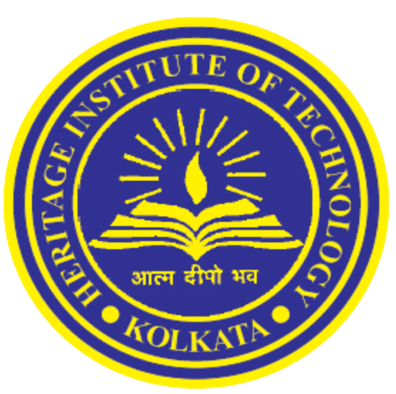

#### Bachelor Of Technology (B.Tech.)
##### Heritage Institute Of Technology, Kolkata
<!-- (Remote) -->
 July 2018 - July 2022

Concentration: **Computer Science & Engineering**\
Degree GPA: **9.05/10**

Relevant Coursework:\
Probability & Statistical Methods, Introduction to Data Analysis with Python & R, Machine Learning,
Linear Algebra, Pattern Recognition, Natural Language Processing

Extracurricular Activities : Participated in data science/ ML hackathons & 2 photography competitions

-----

#### All India Senior School Certificate Examination (AISSCE) [CBSE - 12TH]
May 2017\
Percentage: **92.2**

-----

#### Indian Certificate Of Secondary Education (ICSE) [10TH]
May 2015\
Percentage: **94.8**

-----

