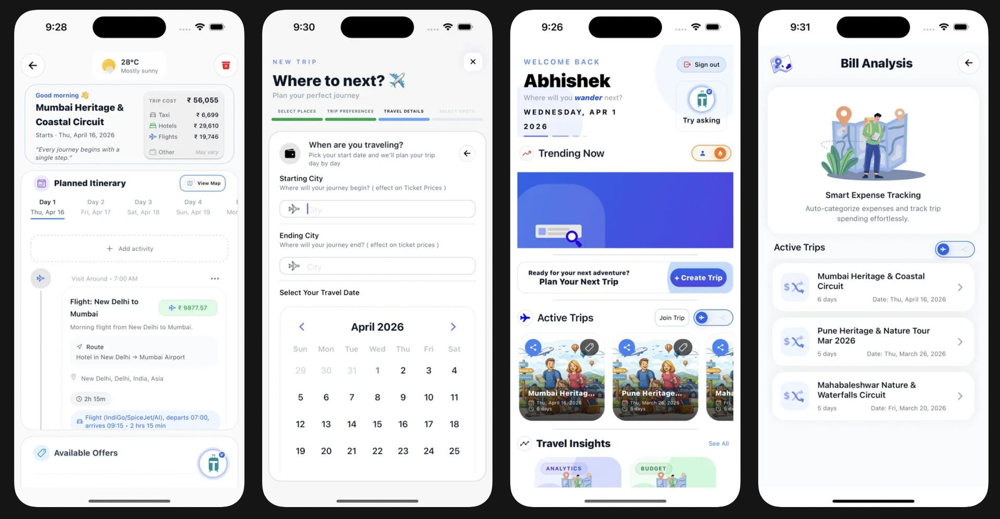
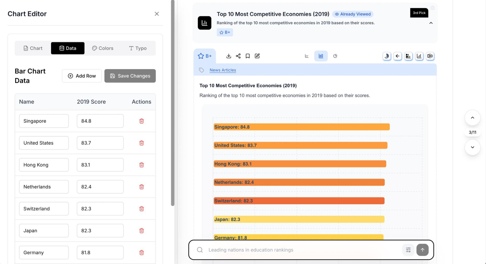
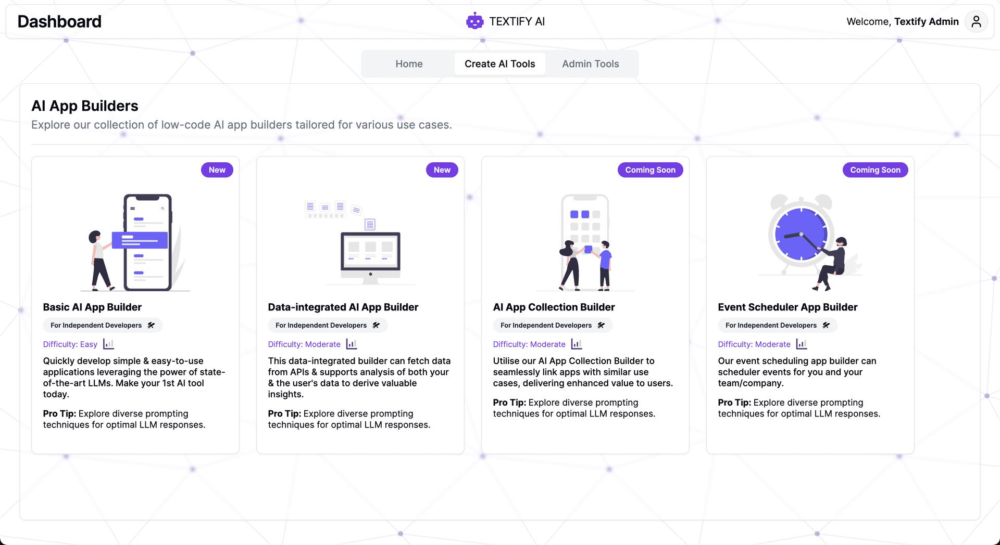
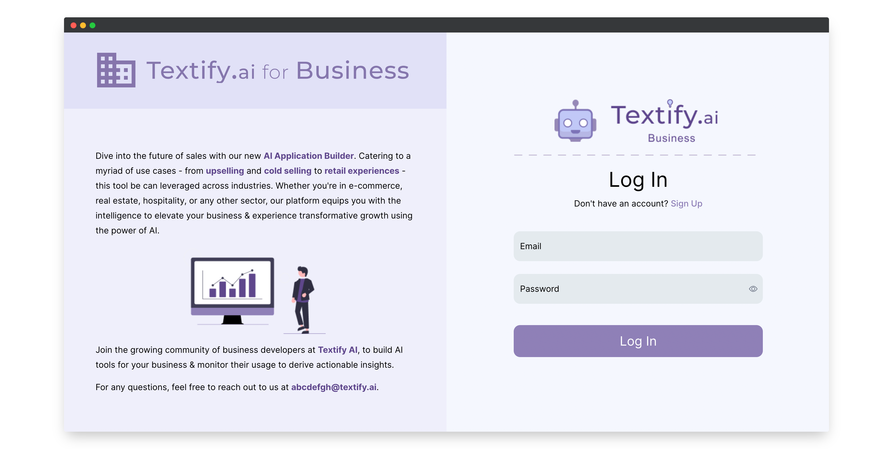
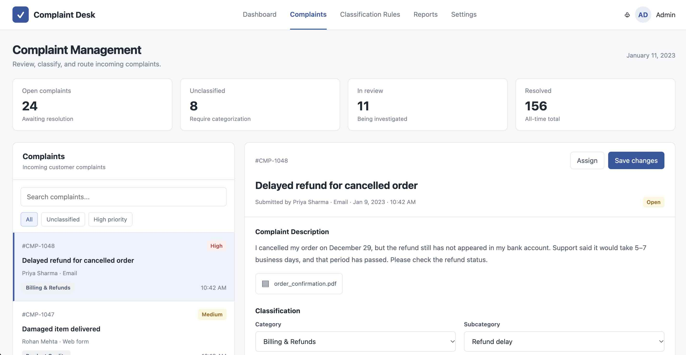

<!-- For now, this page is assumed to be a static description of your courses. You can convert it to a collection similar to `_projects/` so that you can have a dedicated page for each course.

Organize your courses by years, topics, or universities, however you like! -->

## Textify Analytics

*Formerly Textify AI, Registered as CRCJ Technologies Private Limited*

*Indore, Madhya Pradesh, India (Remote) · Dec 2022 - Jul 2026*

### Software Development Engineer 2 (SDE-2)
Apr 2026 - Jul 2026

Tech Stack: *Python, FastAPI, MongoDB, Redis, Firebase, Amazon SES, S3, EC2, Voice AI & Telephony*

**Traveltalk24: AI-assisted itinerary generation for your next trip**

- Re-factored back-end infra to automatically deploy newly submitted apps using dynamically created objects

### Software Development Engineer 1 (SDE-1)
Apr 2023 - Mar 2026

Tech Stack: *Python, FastAPI, JavaScript, Node.js, MongoDB, Redis, Supabase, Azure VMs, Document Intelligence API*

**Analytx: RAG-based charts search platform**

1. Developed a RAG-based charts search engine using Azure OpenAI API, MongoDB Atlas vector search, LangChain, to retrieve relevant charts, matching user query, from a database of 2 million+ charts.

2. Architected an automated data collection and transformation pipeline using Azure Document Intelligence API and OpenAI Batch API, cutting costs by 50% by shifting from immediate to asynchronous processing.

3. Engineered a suite of XGBoost models to predict news-success indicators, with MLflow-driven tracking, Docker-based deployment, and capabilities for real-time single-point inference and asynchronous batch inference.

4. Configured auto-deployments for multiple Python-FastAPI backend APIs to Azure VMs using GitHub Actions CI/CD, with basic Nginx reverse-proxy configuration to serve production websites.

5. Successfully migrated test and production deployments for multiple backend platforms from Azure to GCP, across our core product as well as separate client projects

**Textify AI App & Builder Platform: Web platform for building no-code AI mini-apps**

1. Optimized app platform homepage load times by implementing Redis-based caching for personalized and non-personalized app recommendations serving 20,000+ users across categories including Top, New, Discover Peer Favourites, You Might Also Like, and Textify Curated.

2. Re-architected app execution from individual endpoints per app to a single reusable endpoint, dynamically resolving the app and user tier from each request, fetching its prompts and developer-configured data, and assembling the required context at runtime to generate the app-specific response.

3. Designed a tiered response architecture using Redis and Python RQ, asynchronously queueing requests for regular users while bypassing the queue for Pro users; implemented real-time, end-to-end streaming of text responses from OpenAI through our backend server to the client for Pro users, reducing time to first token by an estimated 60% compared with waiting for the complete response.

4. Built a data-integrated AI builder that lets developers enrich AI-generated responses with their own files (PDF, DOCX, TXT, MD) and outputs from a curated catalogue of 50+ third-party APIs, dynamically combining this data with user inputs within predefined prompts to generate richer, more current responses at runtime.

5. Added a modular AWS S3 storage layer for managing user and developer files, app animations, icons, and other application-level assets across separate buckets.

6. Integrated rich-output capabilities, including top-N image triggering based on developer-defined keywords using in AI-generated responses and customizable Markdown/HTML/CSS templates injected into system prompts to control output structure.

7. Supported biweekly hackathons by preparing workshop slide decks, building detailed submission forms, and reviewing app submissions from college students.

8. Designed dashboard app cards, alert screens, custom app UIs, pop-up forms in Figma

### Software Development Intern

Dec 2022 - Mar 2023

Tech Stack: *Python, Flask, MongoDB, Redis, Hugging Face, scikit-learn*

**Textify AI App Platform (Initial Phase)**

1. Built API endpoints to implement app-specific request queueing using SSE (Server-Sent Events) & Redis

2. Deployed 24 GB GPT-J model with 6 billion parameters on an AWS EC2 instance for classifying complaints

3. Implemented basic CI/ CD pipelines using GitHub Actions for deploying backend APIs.

**Client project & demos**

1. Built multiple demos for client projects spanning Text summarisation, Translation & Question answering.

2. Prepared technical documentation covering model workflows, APIs, and integration details.

3. Deployed machine learning models as production-ready APIs for client applications.

----