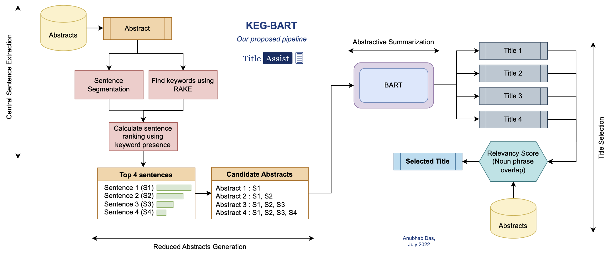

#### Automatic Title Generation From Abstracts Of Research Articles
`Bachelor's Thesis` | Areas covered: `NLP, Deep Learning, Text Generation, Rule-Based Methods`\
December 2021 - July 2022\
Tech Stack: *Python, NumPy, Spacy, NLTK, Scikit-Learn, PyTorch, Simple Transformers, Matplotlib, Seaborn*\
<a href="https://github.com/anubhabdaserrr/abstract2title" style="text-decoration: underline;">Code</a>&nbsp;&nbsp;&nbsp;
<a href="https://drive.google.com/file/d/1HsuBrGWy40y1OrcSQu0nxg1u73QnW_T9/view?usp=sharing" style="text-decoration: underline;">Project Report</a>&nbsp;&nbsp;&nbsp;
<a href="https://docs.google.com/presentation/d/19RaT0oh6l7TTCjCNXVxOsWk3P7WUUj5jBJ8RzD86txE/edit?usp=sharing" style="text-decoration: underline;">Slides</a>&nbsp;&nbsp;&nbsp;
<a href="https://youtube.com/shorts/PXVEbTN8oI8?feature=share" style="text-decoration: underline;">Live Demo (Video)</a>

- Constructed 5 datasets from 5 domains- AI, Mathematical Physics, Astrophysics, Cryptography, Neuroscience by scraping data from ArXiV - To test robustness of models across multiple domains
- Implemented a Dependency Tree based model (DTATG) from scratch based on a pre-existing paper - Model requires no training data
- Trained a bidirectional LSTM model with Attention Mechanism from scratch : Did not perform well
- Fine-tuned BART (Bidirectional Autoregressive Transformer) model : Performs well but gives generic titles
- Developed new model (Keyword-guided BART : KEG-BART) using fine-tuned BART & a module from DTATG to feed modified (smaller & information-dense) abstracts into BART for generating more specific titles\
The algorithm developed by us in this project (KEG-BART) is shown below:

-----