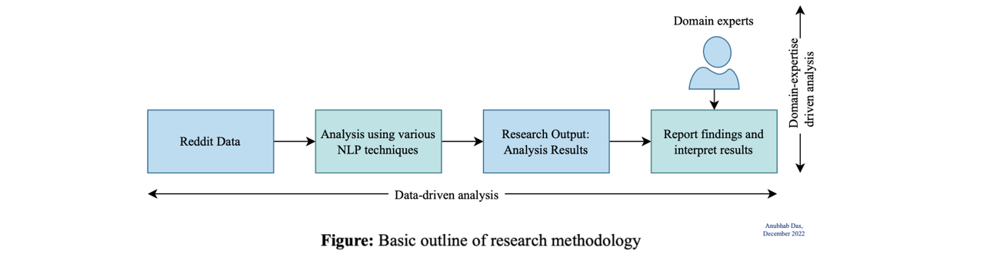
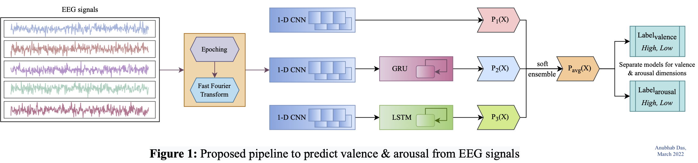
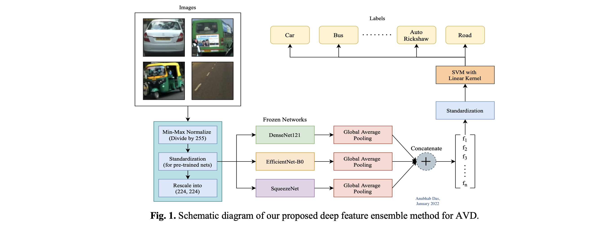
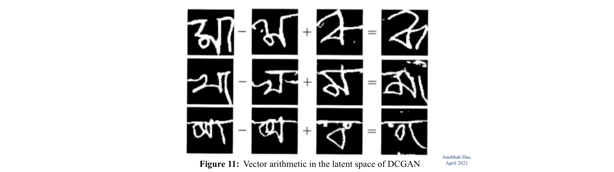

#### Visiting Researcher \| Nokia Bell Labs (Social Dynamics Group), Cambridge
<!-- ((Part-time) Remote) -->
 July 2023 – Present

##### Project 2: Studying health discussions on social media
July 2023 - Present\
Tech Stack: *Python, NumPy, Scipy, Pandas, Matplotlib, Seaborn*
- Ideating & implementing ways to study various forms of engagement in health discussions on social media

##### Project 1: Unpacking dream content on Reddit [(Link)](https://arxiv.org/abs/2307.04167)
March 22 - April 23\
Tech Stack: *Python, NumPy, Pandas, Spacy, NLTK, NetworkX, Matplotlib, Plotly, Gephi*
- Developed a methodology using BERTopic to extract common topics & themes in self-reported dreams on Reddit. (Research accepted & has been presented at IC2S2 conference, Copenhagen)
- Studied the prevalence of extracted themes across time & across vivid, recurring, lucid dreams & nightmares
- Created co-occurrence networks of common themes & health symptoms in dream reports to visualize 40k dreams

-----

#### Machine Learning Research Intern \| Jadavpur University, India
<!-- (Remote) -->
 September 2020 - April 2021 & January 2022 - March 2022

##### Project 3: Emotion detection from EEG signals using hybrid 1D-CNN + LSTM
February 2022 - March 2022\
Tech Stack: *Python, NumPy, Keras, Scikit-learn, Matplotlib*

<!-- Research project carried out in a team of 2, under the supervision of a professor in Dept. of Information Technology, JU -->

- Subject Dependent Approach; Accuracy: 94.11% for valence, 94.39% for arousal (emotion dimensions)
- Subject Independent Approach; Accuracy: 90.09% for valence, 91.39% for arousal

##### Project 2: Automatic Vehicle Detection using feature ensemble of pre-trained networks
January 2022\
Tech Stack: *Python, NumPy, PyTorch, Scikit-learn, Scikit-image, OpenCV, Matplotlib*

<!-- Research project carried out in a team of 2, under the supervision of a professor in Dept. of Information Technology, JU -->

- Classification of patches of images of road scenes in structured (GTI) & unstructured driving scenes (IDD)
- Method 1: Light-weight feature-extractor - Histogram of Oriented Gradients (HoG) with Linear SVM - 89.73% accuracy
- Method 2: Ensemble of 3 pre-trained CNNs as feature extractors with Linear SVM - 99.83% accuracy

##### Project 1: Comparative Analysis of Generative Adversarial Networks for Bangla Character Generation
September 2020 - April 2021\
Tech Stack: *Python, NumPy, PyTorch, Scikit-learn, Matplotlib*

<!-- Worked under the guidance of Prof. N. Das, Dept. of Computer Science -->

- Trained 3 GANs : DCGAN, ACGAN & WGAN-GP for Bangla character generation
- Dataset used : BanglaLekha-Isolated (84 bangla characters : Numerals, basic & compound characters)
- Performance comparison using Inception Score (IS) & Fréchet Inception Distance (FID). Fine-tuned Inception Model prior to evaluation for better evaluation.
- Preliminary attempts have been made to explore the latent space using vector arithmetic to generate unseen compound characters. Some samples for the same, can be seen in the following figure.

-----